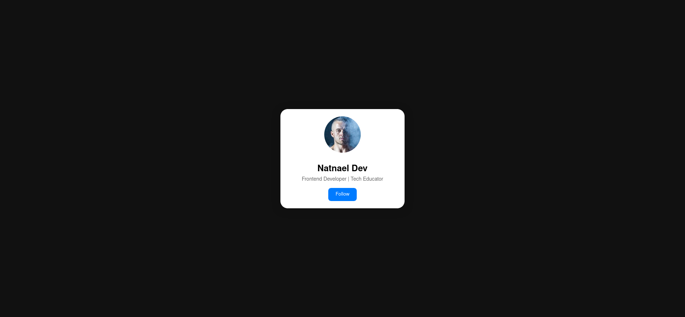
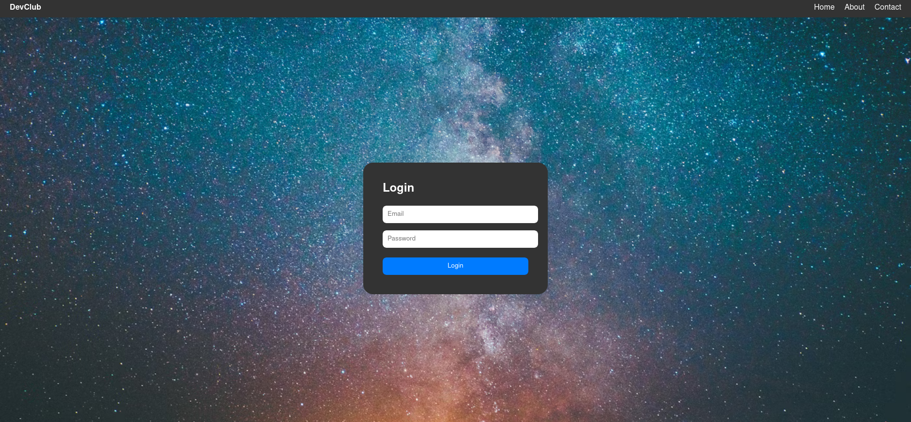
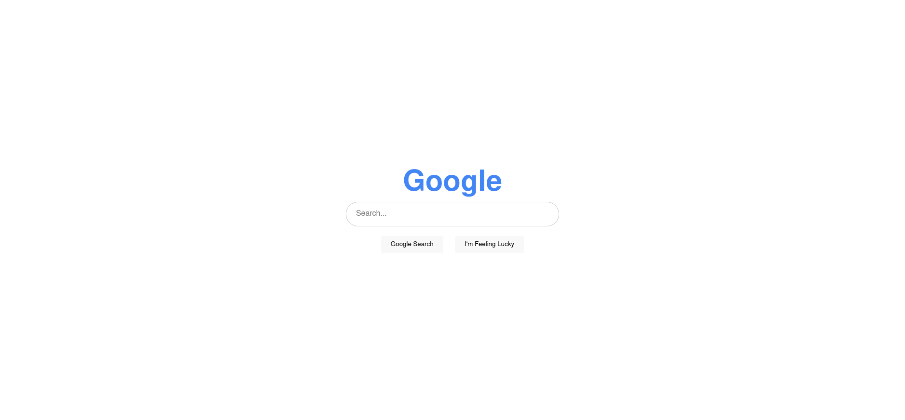

# 🌐 HTML & CSS Practice Challenges – Level 1  
**AUWC Developers Club**  
Hey Web Devs! Here are three beginner-friendly and fun frontend challenges.  
Try to recreate the design from the image and code it using **HTML + CSS only**. No frameworks.  

---

### 🔹 1. Profile Card UI

**🎯 What to build:**  
A clean developer profile card that includes:  
- Profile image  
- Name  
- Role or title (like “Frontend Developer”)  
- Short description  

**💡 Why it matters:**  
You’ll practice the **box model**, **flexbox**, spacing, border-radius, and text alignment.  
It’s also the kind of thing you’d actually use on a portfolio!

---

### 🔹 2. Navbar And Login Page 

**🎯 What to build:**  
A modern top navigation bar that includes:  
- A logo  
- 3-4 links (Home, About, Contact, etc.)  
- Responsive hamburger menu for mobile
- Clean Login Page Centered

**💡 Why it matters:**  
You’ll learn **Nav Bar** and  **login Page**, 

---

### 🔹 3. Google Search Page Clone

**🎯 What to build:**  
Rebuild the homepage of Google with:  
- Centered logo  
- Search input  
- “Google Search” and “I’m Feeling Lucky” buttons  
- Footer links

**💡 Why it matters:**  
It’s great practice for **centering**, **input styling**, and **layouts** using **flexbox or grid**.  
Also fun because everyone knows it!
